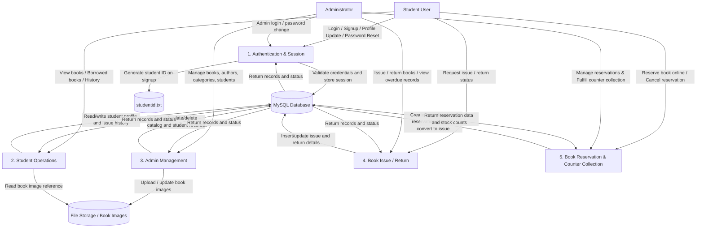

# Data Flow Diagram for the Library Management System

This diagram shows the main data movement between users, application processes, the database, and file storage for the project.

## Summary of main data flows
- Students log in, sign up, update profile, browse books catalog, reserve books online, and view issued/reserved books.
- Admins log in and manage books, categories, authors, students, manage/fulfill student reservations upon counter collection, and issue/return books.
- The PHP application interacts with MySQL for records like users, books, authors, categories, reservations, and issued books.
- Book images are stored in the file system and referenced from the database.
- Student IDs are generated through the local text file.
