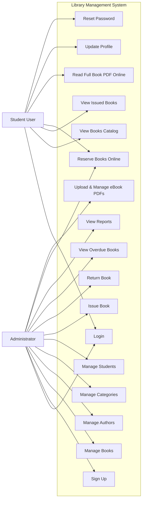

# Use Case Diagram

This is a use case diagram for the Library Management System.

## Notes
- **Students**: Log in, browse the book catalog, reserve physical copies for counter pickup, read full eBooks (PDFs) online, view issued books, update profile, and reset password.
- **Administrators**: Manage catalog (books, eBook PDFs, authors, categories), manage registered students, fulfill/manage online reservations, issue and return books, track inventory, and view overdue alerts.
